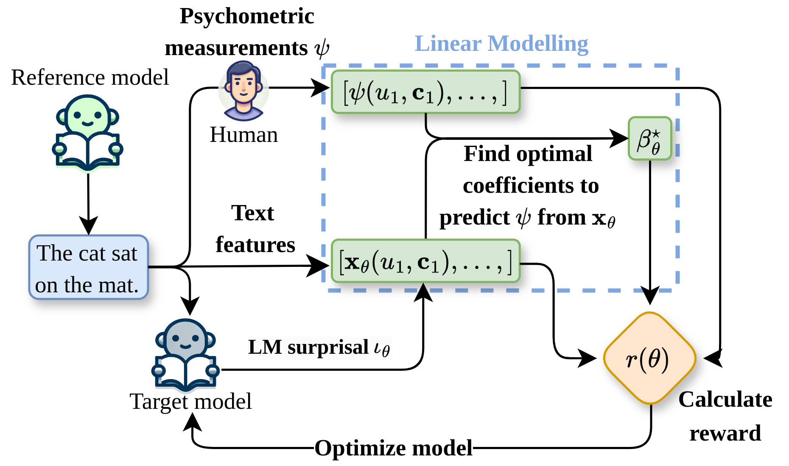

# Reverse-Engineering the Reader

This repository contains the code for our paper [Reverse-Engineering the Reader](https://arxiv.org/abs/2410.13086), where we introduce a technique for aligning language models to human psychometric data.

<p align="center">
  
</p>

## Get Started

All experiments were conducted using Python 3.10 and NVIDIA GeForce RTX 3090, RTX 4090, and RTX 2080 Ti GPUs.

### Install

Clone the repository and install the packages.

```
pip install -r requirements.txt
```

### Configuration

You can specify all configuration parameters for individual runs in `configs` and run a specific setting.
The main configuration files are located in `configs/datasets_dll_wt`.


#### Logging

Note that the script will log metrics using Weights & Biases. To log the metrics, you must add your API key in `model/utils/credentials.py`. To disable logging with wandb, set `use_wandb: False`.

#### Checkpoint Saving

To save checkpoints locally and not on the Euler cluster, you need to specify `save_scratch: False`
If you are running scripts on Euler and want to save them on the scratch space,  you need to add your username in `model/utils/credentials.py`

### Run Experiments

You can run an individual configuration file:

```
python run.py --config_path /path/to/config
```

### Reference

```
@inproceedings{kiegeland-etal-2024-reverse,
    title = "Reverse-Engineering the Reader",
    author = "Kiegeland, Samuel  and
      Wilcox, Ethan  and
      Amini, Afra  and
      Reich, David Robert  and
      Cotterell, Ryan",
    editor = "Al-Onaizan, Yaser  and
      Bansal, Mohit  and
      Chen, Yun-Nung",
    booktitle = "Proceedings of the 2024 Conference on Empirical Methods in Natural Language Processing",
    month = nov,
    year = "2024",
    address = "Miami, Florida, USA",
    publisher = "Association for Computational Linguistics",
    url = "https://aclanthology.org/2024.emnlp-main.526",
    pages = "9367--9389",
    abstract = "Numerous previous studies have sought to determine to what extent language models, pretrained on natural language text, can serve as useful models of human cognition.In this paper, we are interested in the opposite question: whether we can directly optimize a language model to be a useful cognitive model by aligning it to human psychometric data.To achieve this, we introduce a novel alignment technique in which we fine-tune a language model to implicitly optimize the parameters of a linear regressor that directly predicts humans{'} reading times of in-context linguistic units, e.g., phonemes, morphemes, or words, using surprisal estimates derived from the language model. Using words as a test case, we evaluate our technique across multiple model sizes and datasets and find that it improves language models{'} psychometric predictive power.However, we find an inverse relationship between psychometric power and a model{'}s performance on downstream NLP tasks as well as its perplexity on held-out test data.While this latter trend has been observed before (Oh et al., 2022; Shain et al., 2024), we are the first to induce it by manipulating a model{'}s alignment to psychometric data.",
}
```

